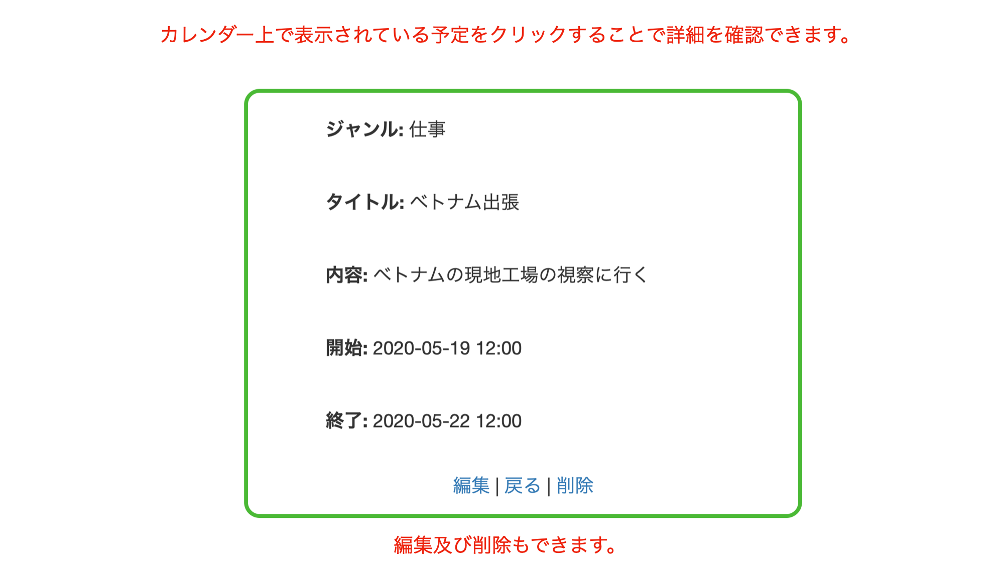

# アプリ名
  schedules
## 概要
  ログイン機能が実装された。スケジュール管理アプリです。以下のページで確認できます。
## 本番環境
  - url : https://serene-plains-01710.herokuapp.com/
  - テスト用アカウント
      email : test@test.com
      pass : testtest
## 制作背景
  タスク管理ができるようなアプリを作りたいと思ったため、プログラミングスクールで学習した言語を用いてスケジュール管理アプリを作成しました。
## DEMO
  
  
  
  

## 工夫したポイント
  - 記入するスケジュールのジャンルによって色が変わるように条件を定義した。
  - ジャンルに関わらず現在より過去のものは全て赤色に変化するようにした。
  - Ruby on Railsのgemであるdeviseを用いてログイン機能を実装した。
  - JavascriptのライブラリーのFullCalendarを導入してカレンダーを表示させた。

## 使用技術
  - Haml
  - Sass
  - jQuery
  - Ruby on Rails
  - Heroku
  - PostgreSQL

## 課題や今後実装したい機能
  - 現在より過去のものはカレンダーに記入できないようにする。
  - 開始時間が終了時間が後の場合記入できないようにする。

## DB設計

### Usersテーブル
|Column|Type|options|
|:----:|:--:|:-----:|
|name|string|null: false|
|email|string|null: false, default: ""|
|encrypted_password|string|null: false, default: ""|
|reset_password_token|string|
|reset_password_sent_at|datetime|
|remember_created_at|datetime|

#### Assosiation 
  - has_many :events

### Eventsテーブル
|Column|Type|options|
|:----:|:--:|:-----:|
|genre|integer|null: false|
|title|string|null: false|
|body|string|null: false|
|start_date|datetime|null: false|
|end_date|datetime|null: false|
|user_id|references|foreign_key: true|

#### Assosiation 
  - belongs_to :user
  - enum genre:{ work: 1, fun: 2 }
